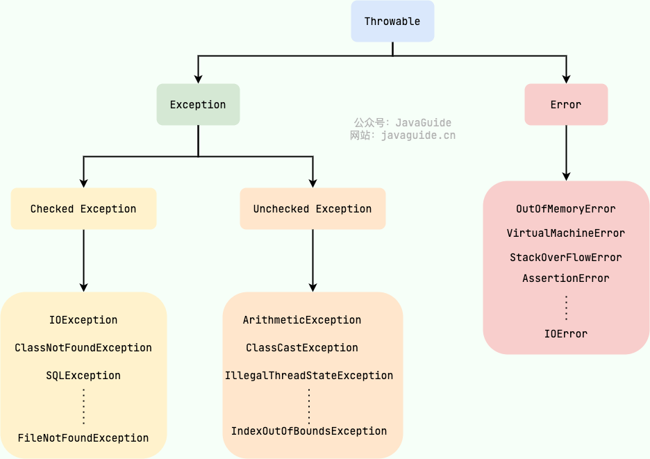

### Exception 和 Error 有什么区别？
在 Java 中，所有的异常都有一个共同的祖先 java.lang 包中的 Throwable 类。Throwable 类有两个重要的自类

#### Checked Exception 和 UnChecked Exception 有什么区别？
Checked Exception 即受检查异常， Java 代码在编译过程中，如果受检查异常没有被 catch 或者 throws 关键字处理的话，就没办法通过编译
除了 RuntimeException 及其子类以外，其他的 Exception 类及其子类都属于受检查异常。常见的受检查异常有：IO 相关的异常，ClassNotFoundException、SQLException
Unchecked Exception 即 不受检查异常 ，Java 代码在编译过程中 ，我们即使不处理不受检查异常也可以正常通过编译。
RuntimeException 及其子类都统称为非受检查异常，常见的有（建议记下来，日常开发中会经常用到）：
* NullPointerException(空指针错误)
* IllegalArgumentException(参数错误比如方法入参类型错误)
* NumberFormatException（字符串转换为数字格式错误，IllegalArgumentException的子类）
* ArrayIndexOutOfBoundsException（数组越界错误）
* ClassCastException（类型转换错误）
* ArithmeticException（算术错误）
* SecurityException （安全错误比如权限不够）
* UnsupportedOperationException(不支持的操作错误比如重复创建同一用户)

#### Throwable 类常用方法有哪些？
* String getMessage(): 返回异常发生时的详细信息
* String toString(): 返回异常发生时的简要描述
* String getLocalizedMessage(): 返回异常对象的本地化信息。使用 Throwable 的子类覆盖这个方法，可以生成本地化信息。如果子类没有覆盖该方法，则该方法返回的信息与 getMessage() 返回的结果相同
* void printStackTrack() 在控制台上打印 Throwable 对象封装的异常信息

#### finally 中的代码一定会执行吗？
不一定的！在某些情况下，finally 中的代码不会被执行。
就比如说 finally 之前虚拟机被终止运行的话，finally 中的代码就不会被执行。
1. 程序所在的线程死亡
2. 关闭 CPU