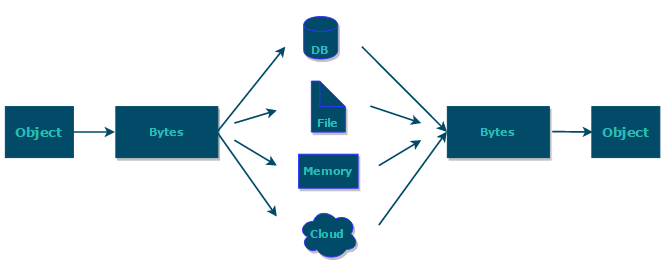

如果需要持久化 Java 对象，比如将 Java 对象保存在文件中，或者在网络传输 Java 对象，这些场景都需要用到序列化

* **序列化**: 将数据结构或对象转换成可以存储或传输的形式，通常是二进制字节流，也可以是 JSON，XML等文本格式
* **反序列化**: 将在序列化过程中所生成的数据转换为原始数据结构或者对象的过程将在虚
 

 ## 常见的序列化协议有哪些？
 ### JDK 自带序列化
transient：
* transient 只能修饰变量，不能修饰类和方法
* transient 修饰的变量，在反序列化后变量值将会被置成类型的默认值
* static 变量因为不属于任何对象(Object)，所以无论有没有 transient 关键字修饰，均不会被序列化。
### Kryo
### Protobuf
### ProtoStuff
### Hessian
