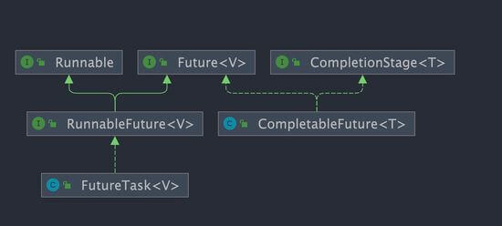
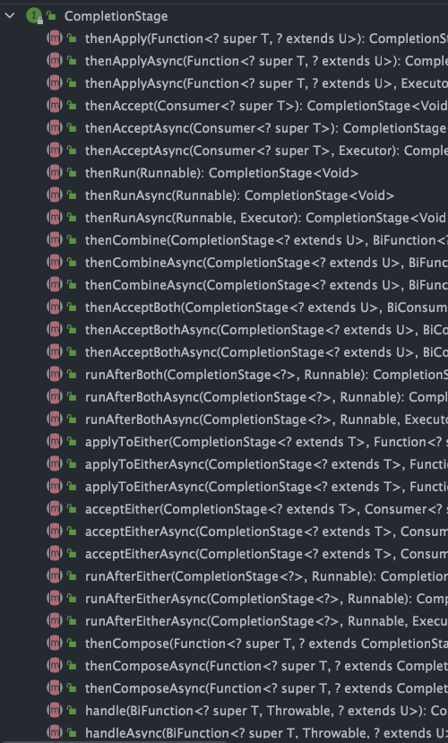

```java
public interface Future<V> {
    boolean cancel(boolean mayInterruptIfRunning);
    // 判断任务是否被取消
    boolean isCancelled();
    // 判断任务是否已经执行完成
    boolean isDone();
    // 获取任务执行结果
    V get() throws InterruptedException, ExecutionException;
    // 指定时间内没有返回计算结果就抛出 TimeOutException 异常
    V get(long timeout, TimeUnit unit)
}
```

* 取消任务
* 判断任务是否被取消
* 判断任务是否已经执行完成
* 获取任务执行结果

## CompletableFuture

https://javaguide.cn/java/concurrent/completablefuture-intro.html#%E5%B9%B6%E8%A1%8C%E8%BF%90%E8%A1%8C%E5%A4%9A%E4%B8%AA-completablefuture

Future 在实际使用过程中存在一些局限性比如不支持异步任务的编排组合、获取计算结果的 get() 方法为阻塞调用。

CompletionStage 接口描述了一个异步计算的阶段。很多计算可以分成多个阶段或步骤，此时可以通过它将所有步骤组合起来，形成异步计算的流水线。



### CompletableFuture 常见操作

#### 创建 CompletableFuture

#### 处理异步结算的结果

```
static <U> CompletableFutre<U> supplyAsync(Supplier<U> supplier);

```

#### 异常处理

#### 组合 CompletableFutre

#### 并行运行多个 CompletableFuture

### CompletableFuture 使用建议

#### 使用自定义线程

CompletableFuture 默认使用全局共享的 ForkJoinPool.commonPool() 作为执行器，所有未指定执行器的异步任务都会使用该线程池。这意味着应用程序、多个库或框架（如 Spring、第三方库）若都依赖 CompletableFuture，默认情况下它们都会共享同一个线程池。

虽然 `ForkJoinPool` 效率很高，但当同时提交大量任务时，可能会导致资源竞争和线程饥饿，进而影响系统性能。

为避免这些问题，建议为 `CompletableFuture` 提供自定义线程池，带来以下优势：

* **隔离性**：为不同任务分配独立的线程池，避免全局线程池资源争夺。
* **资源控制**：根据任务特性调整线程池大小和队列类型，优化性能表现。
* **异常处理**：通过自定义 ThreadFactory 更好地处理线程中的异常情况。

#### 尽量避免使用 get()

#### 正确进行异常处理

#### 合理组合多个异步任务
