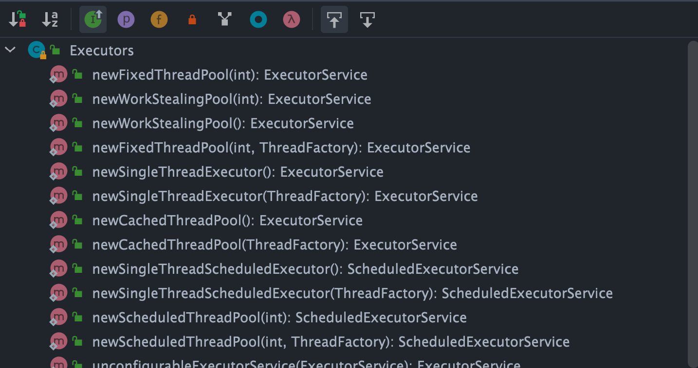

### ThreadLocal

每个线程都有一个自己的专属本地变量
ThreadLocal 类的 set()方法

```Java
public void set(T value) {
    //获取当前请求的线程
    Thread t = Thread.currentThread();
    //取出 Thread 类内部的 threadLocals 变量(哈希表结构)
    ThreadLocalMap map = getMap(t);
    if (map != null)
        // 将需要存储的值放入到这个哈希表中
        map.set(this, value);
    else
        createMap(t, value);
}
ThreadLocalMap getMap(Thread t) {
    return t.threadLocals;
}
```

最终的变量是放在了当前线程的 ThreadLocalMap 中，并不是存在 ThreadLocal 上，**`ThreadLocal` 可以理解为只是`ThreadLocalMap`的封装，传递了变量值。** `ThrealLocal` 类中可以通过`Thread.currentThread()`获取到当前线程对象后，直接通过`getMap(Thread t)`可以访问到该线程的`ThreadLocalMap`对象。

**每个`Thread`中都具备一个`ThreadLocalMap`，而`ThreadLocalMap`可以存储以`ThreadLocal`为 key ，Object 对象为 value 的键值对。**

#### ThreadLocal 内存泄漏是怎么导致的？

ThreadLocalMap 中使用的 key 为 ThreadLocal 的弱引用，而 value 是强引用。所以，如果 `ThreadLocal` 没有被外部强引用的情况下，在垃圾回收的时候，key 会被清理掉，而 value 不会被清理掉。

这样一来，`ThreadLocalMap` 中就会出现 key 为 null 的 Entry。假如我们不做任何措施的话，value 永远无法被 GC 回收，这个时候就可能会产生内存泄露。`ThreadLocalMap` 实现中已经考虑了这种情况，在调用 `set()`、`get()`、`remove()` 方法的时候，会清理掉 key 为 null 的记录。使用完 `ThreadLocal`方法后最好手动调用`remove()`方法

# 线程池

#### 为什么要用线程池？

线程池提供了一种限制和管理资源（包括执行一个任务）的方式。每个线程池还维护一些基本统计信息，例如已完成任务的数量。

* 降低资源消耗。通过重复利用已创建的线程降低线程创建和销毁造成的消耗
* 提高响应速度。当任务到达时，任务可以不需要等到线程创建就能立即执行
* 提高线程的可管理性。线程是稀缺资源，如果无限制的创建，不仅会消耗系统资源，还会降低系统的稳定性，使用线程池可以进行统一的进行分配，调优和监控

## 如何创建线程池？

### 方式一：通过 ThreadPoolExecutor 构造函数来创建（推荐）


### 方式二：通过 Executor 框架的工具类 Executors 来创建

Executors 工具类提供的创建线程池的方法如下图所示：


* newFixedThreadPool, 固定线程数量的线程池。该线程池中的线程数量始终不变。当有一个新的任务提交时，线程池中若有空闲线程，则立即执行。若没有，则新的任务会被暂存在一个任务队列中，待有线程空闲时，便处理在任务队列中的任务。
* newSingleThreadExecutor，只有一个线程的线程池。若多余一个任务被提交到该线程池，任务会被保存在一个任务队列中，待线程空闲，按先入先出的顺序执行队列中的任务。
* newCachedThreadPool，可根据实际情况调整线程数量的线程池。线程池的线程数量不确定，但若有空闲线程可以复用，则会优先使用可复用的线程。若所有线程均在工作，又有新的任务提交，则会创建新的线程处理任务。所有线程在当前任务执行完毕后，将返回线程池进行复用。
* newScheduledThreadPool，给定的延迟后运行任务或者定期执行任务的线程池
