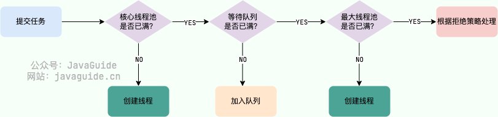

### ThreadLocal

每个线程都有一个自己的专属本地变量
ThreadLocal 类的 set()方法

```Java
public void set(T value) {
    //获取当前请求的线程
    Thread t = Thread.currentThread();
    //取出 Thread 类内部的 threadLocals 变量(哈希表结构)
    ThreadLocalMap map = getMap(t);
    if (map != null)
        // 将需要存储的值放入到这个哈希表中
        map.set(this, value);
    else
        createMap(t, value);
}
ThreadLocalMap getMap(Thread t) {
    return t.threadLocals;
}
```

最终的变量是放在了当前线程的 ThreadLocalMap 中，并不是存在 ThreadLocal 上，**`ThreadLocal` 可以理解为只是`ThreadLocalMap`的封装，传递了变量值。** `ThrealLocal` 类中可以通过`Thread.currentThread()`获取到当前线程对象后，直接通过`getMap(Thread t)`可以访问到该线程的`ThreadLocalMap`对象。

**每个`Thread`中都具备一个`ThreadLocalMap`，而`ThreadLocalMap`可以存储以`ThreadLocal`为 key ，Object 对象为 value 的键值对。**

#### ThreadLocal 内存泄漏是怎么导致的？

ThreadLocalMap 中使用的 key 为 ThreadLocal 的弱引用，而 value 是强引用。所以，如果 `ThreadLocal` 没有被外部强引用的情况下，在垃圾回收的时候，key 会被清理掉，而 value 不会被清理掉。

这样一来，`ThreadLocalMap` 中就会出现 key 为 null 的 Entry。假如我们不做任何措施的话，value 永远无法被 GC 回收，这个时候就可能会产生内存泄露。`ThreadLocalMap` 实现中已经考虑了这种情况，在调用 `set()`、`get()`、`remove()` 方法的时候，会清理掉 key 为 null 的记录。使用完 `ThreadLocal`方法后最好手动调用`remove()`方法

# 线程池

#### 为什么要用线程池？

线程池提供了一种限制和管理资源（包括执行一个任务）的方式。每个线程池还维护一些基本统计信息，例如已完成任务的数量。

* 降低资源消耗。通过重复利用已创建的线程降低线程创建和销毁造成的消耗
* 提高响应速度。当任务到达时，任务可以不需要等到线程创建就能立即执行
* 提高线程的可管理性。线程是稀缺资源，如果无限制的创建，不仅会消耗系统资源，还会降低系统的稳定性，使用线程池可以进行统一的进行分配，调优和监控

## 如何创建线程池？

### 方式一：通过 ThreadPoolExecutor 构造函数来创建（推荐）


#### 线程池常见的参数

```java
    /**
     * 用给定的初始参数创建一个新的ThreadPoolExecutor。
     */
    public ThreadPoolExecutor(int corePoolSize,//线程池的核心线程数量
                              int maximumPoolSize,//线程池的最大线程数
                              long keepAliveTime,//当线程数大于核心线程数时，多余的空闲线程存活的最长时间
                              TimeUnit unit,//时间单位
                              BlockingQueue<Runnable> workQueue,//任务队列，用来储存等待执行任务的队列
                              ThreadFactory threadFactory,//线程工厂，用来创建线程，一般默认即可
                              RejectedExecutionHandler handler//拒绝策略，当提交的任务过多而不能及时处理时，我们可以定制策略来处理任务
                               ) {
        if (corePoolSize < 0 ||
            maximumPoolSize <= 0 ||
            maximumPoolSize < corePoolSize ||
            keepAliveTime < 0)
            throw new IllegalArgumentException();
        if (workQueue == null || threadFactory == null || handler == null)
            throw new NullPointerException();
        this.corePoolSize = corePoolSize;
        this.maximumPoolSize = maximumPoolSize;
        this.workQueue = workQueue;
        this.keepAliveTime = unit.toNanos(keepAliveTime);
        this.threadFactory = threadFactory;
        this.handler = handler;
    }

```

* coolPoolSize: 任务队列未达到队列容量时，最大可以同时运行的线程数量
* maximumPoolSize：任务队列中存放的任务达到队列容量的时候，当前可以同时运行的线程数量变为最大线程数
* workQueue：新任务来的时候会先判断当前运行的线程数量是否达到核心线程数，如果达到的话，新任务就会被存放在队列中
* keepAliveTime: 当线程池中的线程数量大于 corePoolSize，即有非核心线程（线程池中核心线程以外的线程）时，这些非核心线程空闲后不会立即销毁，而是会等待，直到等待的时间超过了 keepAliveTime 才会被回收销毁
* unit: keepAliveTime 的参数时间单位
* threadFactory: executor 创建新线程的时候会用到
* handler: 拒绝策略

#### 线程池的拒绝策略有哪些？

* ThreadPoolExecutor.AbortPolicy: 抛出 RejectedExecutionException 来拒绝新任务的处理
* ThreadPoolExecutor.CallerRunsPolicy: 调用执行自己的线程运行任务，也就是直接调用 execute 方法的线程中运行（run）被拒绝的任务，如果执行程序已被关闭，则会丢弃任务。因此这种策略会降低对于新任务提交速度，影响程序的整体性能。如果你的应用程序可以承受此延迟并且你要求任何一个任务请求都要被执行的话，你可以选择这个策略。
* ThreadPoolExecutor.DiscardPolicy: 不处理新任务，直接丢弃掉
* ThreadPoolExecutor.DiscardOldestPolicy: 此策略将丢弃最早的未处理的任务请求。

### 方式二：通过 Executor 框架的工具类 Executors 来创建

Executors 工具类提供的创建线程池的方法如下图所示：


* newFixedThreadPool, 固定线程数量的线程池。该线程池中的线程数量始终不变。当有一个新的任务提交时，线程池中若有空闲线程，则立即执行。若没有，则新的任务会被暂存在一个任务队列中，待有线程空闲时，便处理在任务队列中的任务。
* newSingleThreadExecutor，只有一个线程的线程池。若多余一个任务被提交到该线程池，任务会被保存在一个任务队列中，待线程空闲，按先入先出的顺序执行队列中的任务。
* newCachedThreadPool，可根据实际情况调整线程数量的线程池。线程池的线程数量不确定，但若有空闲线程可以复用，则会优先使用可复用的线程。若所有线程均在工作，又有新的任务提交，则会创建新的线程处理任务。所有线程在当前任务执行完毕后，将返回线程池进行复用。
* newScheduledThreadPool，给定的延迟后运行任务或者定期执行任务的线程池

#### Executors 返回线程池对象的弊端如下：

* FixedThreadPool 和 SingleThreadExecutor： 使用的是有界阻塞队列 LinkedBlockingQueue，其任务队列的最大长度为 Integer.MAX_VALUE, 可能堆积大量的请求，从而导致 OOM。
* CachedThreadPool：使用的是同步队列 SynchronousQueue，允许创建的线程数量为 `Integer.MAX_VALUE` ，如果任务数量过多且执行速度较慢，可能会创建大量的线程，从而导致 OOM。
* `ScheduledThreadPool` 和 `SingleThreadScheduledExecutor` :使用的无界的延迟阻塞队列 `DelayedWorkQueue` ，任务队列最大长度为 `Integer.MAX_VALUE` ，可能堆积大量的请求，从而导致 OOM。

### 线程池处理任务的流程？



### 线程池在提交任务前，可以提前创建线程吗？

可以的

* boolean prestartCoreThread():启动一个线程，等待任务，如果已达到核心线程数，这个方法返回 false，否则返回 true；
* int prestartAllCoreThreads():启动所有的核心线程，并返回启动成功的核心线程数。


### 线程池中线程异常后，销毁还是复用？

* **使用 execute() 提交任务**：当任务通过 execute() 提交到线程池并在执行过程中抛出异常时，如果这个异常没有在任务内被捕获，那么该异常会导致当前线程终止，并且异常会被打印到控制台或日志文件中。线程池会检测到这种线程终止，并创建一个新线程来替换它，从而保持配置的线程数不变。
* **使用 submit() 提交任务**：对于通过`submit()`提交的任务，如果在任务执行中发生异常，这个异常不会直接打印出来。相反，异常会被封装在由`submit()`返回的`Future`对象中。当调用`Future.get()`方法时，可以捕获到一个`ExecutionException`。在这种情况下，线程不会因为异常而终止，它会继续存在于线程池中，准备执行后续的任务。


## 线程设计

### 如何设定线程池的大小？

* **CPU 密集型任务(N+1)**：这种任务消耗的主要是 CPU 资源，可以将线程数设置为 N（CPU核心数）+ 1。比 CPU 核心数多出来的一个线程是为了防止线程偶发的缺页中断，或者其它原因导致的任务暂停而带来的影响。一旦任务暂停，CPU 就会处于空闲状态，而在这种情况下多出来的一个线程就可以充分利用 CPU 的空闲时间。
* **I/O 密集型任务(2N)：** 这种任务应用起来，系统会用大部分的时间来处理 I/O 交互，而线程在处理 I/O 的时间段内不会占用 CPU 来处理，这时就可以将 CPU 交出给其它线程使用。因此在 I/O 密集型任务的应用中，我们可以多配置一些线程，具体的计算方法是 2N。
